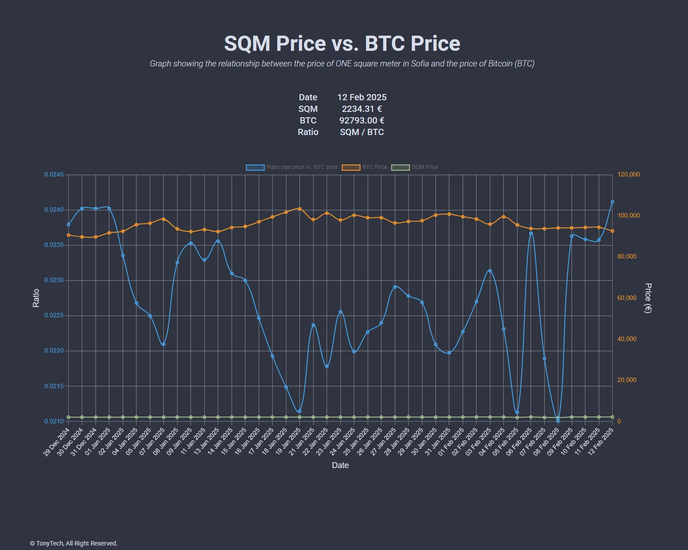

[](https://github.com/tonytech83/sqm-vs-btc/actions/workflows/main.yml)
[](https://github.com/tonytech83/sqm-vs-btc/actions/workflows/keep_it_alive.yml)

# SQM vs BTC

A Flask-based web application that compares the average price per square meter of real estate in Sofia with the current price of Bitcoin (BTC). The app dynamically fetches real estate prices and Bitcoin prices from multiple sources, calculates their ratio, and provides visual insights using Chart.js.

<div align="center" display="flex">
    
</div>

---

## Features

- **Web Interface**: Displays the latest data for sqm and BTC prices along with their ratio.
  - Real estate prices are scraped from [Imoti.net](https://www.imoti.net/bg/sredni-ceni).
  - Bitcoin prices are fetched from multiple sources including [CoinGecko](https://www.coingecko.com/), [Binance](https://www.binance.com/), and [Kraken](https://www.kraken.com/).
- **Data Caching**: Cached results for efficient API response.
- **PostgreSQL Integration**: Stores daily sqm and BTC prices with a unique entry per day.
- **Error Handling**: Ensures no invalid data is stored in the database if fetching fails.
- **Preloading Data**: Preloads sqm and BTC prices during the first request to optimize user experience.
- **Logging**: Comprehensive logging for debugging and monitoring.

---

## Project Structure

```plain
sqm-vs-btc/
├── app.py              # Flask application entry point
├── Dockerfile
├── gunicorn_config.py  # gunicorn configuration file
├── pic.jpg
├── README.md           # Project documentation
├── requirements.txt    # Python dependencies
├── static              # Static files (CSS, JS, etc.)
│   ├── css
│   │   └── styles.css
│   └── js
│       └── chart.js
├── templates
│   └── index.html      # HTML template for the web interface
├── tests
│   ├── __init__.py
│   └── test_app.py     # UI unit tests
└── WebApp
    ├── helpers.py      # Helper functions for data fetching and database
    └── views.py        # Views
```

## Requirements
- Python 3.8+
- Flask
- BeautifulSoup (bs4)
- Requests
- PostgreSQL

## Installation
1. Clone the repository:
```sh
git clone https://github.com/tonytech83/sqm-vs-btc.git
cd sqm-vs-btc
```
2. Create and activate a virtual environment:
```sh
python -m venv venv
source venv/bin/activate  # On Windows: venv\Scripts\activate
```
3. Install dependencies:
```sh
pip install -r requirements.txt
```

## Running the Application
1. Set up your environment variables for database connection:
   - `DB_NAME`
   - `DB_USER`
   - `DB_PASSWORD`
   - `DB_HOST`
   - `DB_PORT`

2. Start the application:
```sh
flask run # or python app.py
```
3. Open the application in your browser at http://127.0.0.1:5000.

## Database Schema
```sql
CREATE TABLE IF NOT EXISTS data (
    id SERIAL PRIMARY KEY,
    date TEXT NOT NULL UNIQUE,
    btc_price NUMERIC(18, 8) NOT NULL,
    sqm_price NUMERIC(18, 8) NOT NULL,
    ratio NUMERIC(20, 18) NOT NULL
);
```

## License

This project is open-source and available under the MIT License.

## Contributing

Contributions are welcome! Feel free to open issues or submit pull requests.

<br/>

<h6 align="center"> Made with by Anton Petrov </h6>
